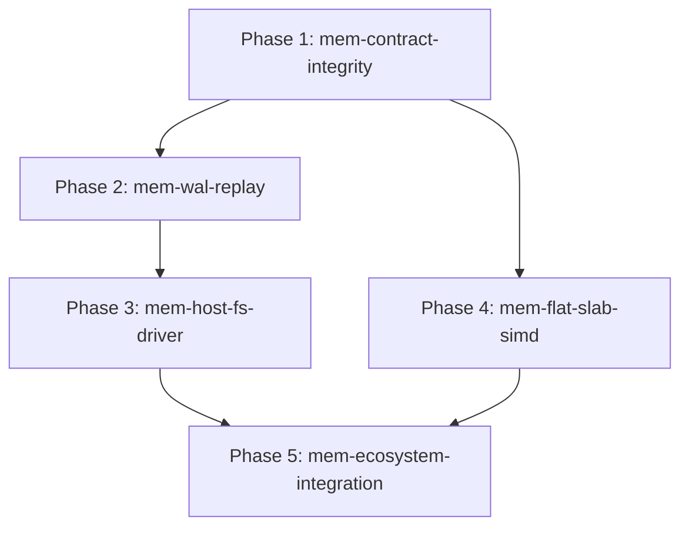

# ASL-Mem Execution Phases & Roadmap (Steps Protocol)

**Orchestrator**: Antigravity (`steps`)  
**Separation of Duties**: Implementer writes code; reviewer evaluates clean context; orchestrator commits.  
**Execution Strategy**: Sequential DAG waves with strict pre-commit verification gates.

---

## 1. Phase Dependency Graph (DAG)

---

## 2. Phase Matrix

| Phase ID | Description | Priority | Depends On | Owns | Gate Command | Status |
|---|---|---|---|---|---|---|
| `mem-contract-integrity` | Graph node removal with edge cascading, vector dimension validation, zero-vector bounds | `P0` | `[]` | `src/graph.asl`, `src/store.asl`, `tests/mem_test.asl` | `node mem/tests/driver_test.js` | `done` |
| `mem-wal-replay` | Stream replay state rehydration, checkpoint compaction, corrupted frame tolerance | `P0` | `[mem-contract-integrity]` | `src/wal.asl`, `src/engine.asl`, `tests/engine_test.asl` | `node mem/tests/driver_test.js` | `done` |
| `mem-host-fs-driver` | TypeScript/Node host filesystem driver (streaming append, atomic snapshot rename, fsync) | `P1` | `[mem-wal-replay]` | `bridges/ts/driver.ts`, `bridges/ts/index.ts`, `tests/driver_test.js` | `node mem/tests/driver_test.js` | `done` |
| `mem-flat-slab-simd` | Contiguous Float32Array slab, SIMD-128 dot product kernels, sub-1ms search for 25k vectors | `P1` | `[mem-contract-integrity]` | `benchmark/run.js`, `src/store.asl` | `node mem/tests/math.test.js` | `done` |
| `mem-ecosystem-integration` | Wire MemoryEngine into `agent-core` and `eddie` as default episodic/session substrate | `P2` | `[mem-host-fs-driver, mem-flat-slab-simd]` | `../agent-core/`, `../eddie/`, `package.json` | `python3 tools/sync_workspace.py --check` | `done` |
